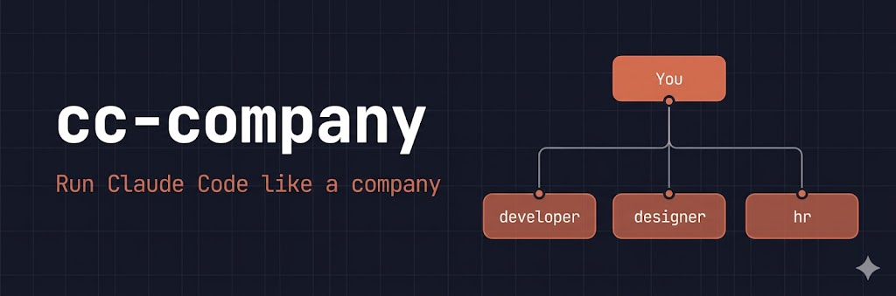

<p align="center">
  
</p>

<p align="center">
  <strong>Run Claude Code like a company</strong> — organize AI agents by role, run them with one command.
</p>

<p align="center">
  <a href="https://www.npmjs.com/package/cc-company"></a>
  <a href="https://github.com/choesumin/cc-company/blob/main/LICENSE"></a>
</p>

```bash
npx cc-company init
cc-company run developer "Fix the login bug"
cc-company run designer "Redesign the onboarding flow"
```

## Why?

Claude Code supports subagents, skills, hooks, MCP, and settings. But there's **no way to bundle them per role.**

A frontend developer needs a different set of subagents than a backend developer. A QA engineer and a DevOps engineer use different skills and hooks. If you're manually combining CLI flags or copying config files every time — that's the problem cc-company solves.

**cc-company bundles all Claude Code configuration into a single unit called an agent (role).**

```
cc-company agent create backend-dev
cc-company agent backend-dev add subagent db-expert
cc-company agent backend-dev add subagent api-designer
cc-company agent backend-dev add skill deploy-k8s

cc-company run backend-dev "Optimize the slow query on /api/users"
# → Claude Code runs with db-expert + api-designer subagents, deploy-k8s skill,
#   and the backend-dev system prompt — all in one command.
```

- **Agent** = a role. Bundles system prompt + subagents/skills/hooks/MCP/settings into one unit.
- **Subagent, Skill, Hook** = managed in a shared pool. Can be shared across agents or used independently.
- `.cc-company/` is committed to git. Your entire team shares the same agent setup.

## Install

```bash
npm install -g cc-company
```

> Requires [Claude Code](https://docs.anthropic.com/en/docs/claude-code) CLI installed and authenticated.

## Quick Start

### 1. Initialize

```bash
cc-company init
```

Creates a `.cc-company/` directory with 3 default agents: `developer`, `designer`, `hr` — each pre-configured with role-specific prompts and subagents.

### 2. Run an Agent

```bash
# Interactive mode
cc-company run developer "Refactor the auth module"

# Headless mode (for scripts/CI)
cc-company run developer "Run all tests and fix failures" -p

# Pass any Claude Code flag
cc-company run developer "Explain this codebase" --model opus
```

### 3. Customize

```bash
# Create a new agent
cc-company agent create qa-engineer

# Add a subagent to it
cc-company agent qa-engineer add subagent test-strategist

# Add a shared skill
cc-company agent qa-engineer add skill deploy
```

## How It Works

```
cc-company run developer "Fix the bug"
        │
        ▼
┌─ Loads agent config ──────────────────────┐
│  prompt.md → --append-system-prompt-file  │
│  subagents → --agents '{...}'             │
│  mcp.json  → --mcp-config                │
│  settings  → --settings                   │
└───────────────────────────────────────────┘
        │
        ▼
  claude "Fix the bug" --append-system-prompt-file ...
```

cc-company translates your agent configuration into Claude Code CLI flags, then spawns `claude` with full stdin/stdout passthrough. No API keys needed — it uses your existing Claude Code subscription.

## Directory Structure

```
.cc-company/
├── config.json           # Project config
├── agents/
│   ├── developer/
│   │   ├── agent.json    # Role metadata + resource refs
│   │   ├── prompt.md     # System prompt for this role
│   │   ├── settings.json # Claude Code settings (optional)
│   │   └── mcp.json      # MCP servers (optional)
│   ├── designer/
│   └── hr/
├── subagents/            # Shared specialist pool
├── skills/               # Shared capabilities
├── hooks/                # Shared hooks
└── runs/                 # Execution logs (JSON)
```

## Commands

| Command | Description |
|---|---|
| `cc-company init` | Initialize project (add `--force` to overwrite) |
| `cc-company run <agent> <prompt>` | Run an agent |
| `cc-company agent create <name>` | Create a new agent |
| `cc-company agent list` | List all agents |
| `cc-company agent remove <name>` | Remove an agent |
| `cc-company agent <name> show` | Show agent details |
| `cc-company agent <name> add subagent <res>` | Assign a subagent |
| `cc-company agent <name> add skill <res>` | Assign a skill |
| `cc-company agent <name> remove subagent <res>` | Unassign a subagent |
| `cc-company subagent list` | List shared subagents |
| `cc-company skill list` | List shared skills |
| `cc-company hook list` | List shared hooks |

## Default Agents

| Agent | Role | Subagents | Skills |
|---|---|---|---|
| `developer` | Software development | git-expert, code-reviewer | deploy |
| `designer` | UI/UX design | ux-researcher | design-system |
| `hr` | Talent & culture | recruiter | onboarding |

## License

MIT
